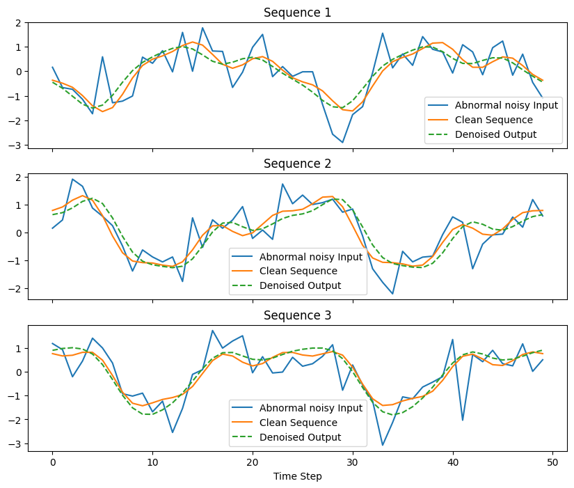

# Denoising-Autoencoder-for-Complex-Time-Series-Data
This project implements a denoising autoencoder using PyTorch to clean noisy synthetic time-series data. The dataset simulates real-world signals by combining multiple sinusoids and adding different types of noise. The goal is to train a model that can reconstruct clean signals from corrupted inputs.

---

## 🔑 Key Features

* **Synthetic Data Generation**

  * Combines multiple sine waves with varying frequencies/phases.
  * Adds **Gaussian noise, random spikes, and uniform noise** for realism.

* **Custom Denoising Autoencoder**

  * Encoder–decoder architecture with nonlinear compression.
  * **Xavier initialization** for stable training.
  * Trained with **Adam optimizer** and **MSE loss**.

* **Training & Evaluation**

  * Mini-batch training with progress logging.
  * Visualization of noisy input, clean sequence, and denoised output.

---

## 📂 Project Structure

```
│── denoising_autoencoder.py   # Main code file  
│── README.md                  # Project documentation  
```

---

## ⚙️ Installation

Clone the repository and install dependencies:

```bash
git clone https://github.com/thatboypage/denoising-autoencoder-time-series.git
cd denoising-autoencoder-time-series
pip install torch numpy matplotlib scikit-learn
```

---

## 🚀 Usage

Run the script to train the model and visualize results:

```bash
python denoising_autoencoder.py
```

---

## 📊 Results

The model effectively learns to suppress noise and reconstruct clean signals.

Example visualization:

* **Blue**: Noisy input sequence
* **Orange**: Ground truth clean sequence
* **Green (dashed)**: Denoised output

<p align="center">
  
</p>

---

## 🔮 Potential Applications

* **Robotics**: Filtering noisy sensor signals.
* **Healthcare**: ECG/EEG signal denoising.
* **IoT**: Noise reduction in smart devices.
* **Predictive Maintenance**: Cleaning vibration/fault signals.

---

## 📌 Next Steps

* Extend model with **LSTMs/GRUs** for sequential memory.
* Add **evaluation metrics**: SNR, PSNR, correlation.
* Experiment with **real-world datasets** (ECG, vibration data).

---

## 👨‍💻 Author

Developed by [Richard Olanite](https://www.linkedin.com/in/richard-olanite-55b4b0241/).

---
